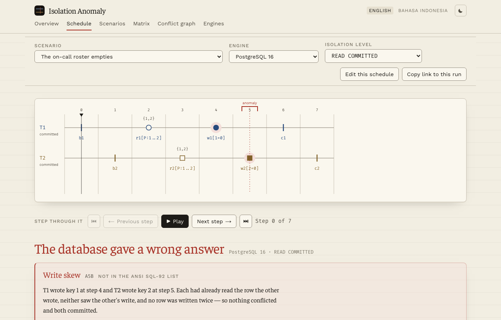
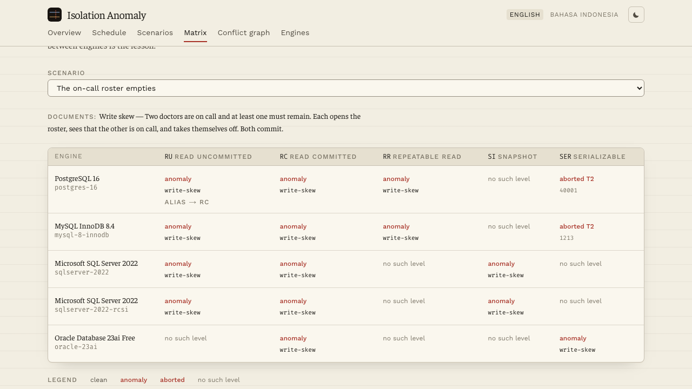

<div align="center">

<picture>
  <source media="(prefers-color-scheme: dark)" srcset="public/brand/lockup-dark.png">
  
</picture>

<br>

**[Open the live site &rarr;](https://andifathulms.github.io/isolation-anomaly/)**

[](https://github.com/andifathulms/isolation-anomaly/actions/workflows/deploy.yml)


</div>

<br>

<picture>
  <source media="(prefers-color-scheme: dark)" srcset="docs/screenshots/schedule-dark.png">
  
</picture>

<br>

**Interleave two transactions by hand, watch the anomaly happen, then switch database engine and isolation level and watch the same schedule behave completely differently.**

Hand-built transaction schedules executed against modelled database engines, with anomalies named and cited, and the same schedule compared across engines and isolation levels. Static site, no backend.

This models **documented behaviour for a fixed operation set at specific engine versions**. It is not a database. Cases outside the modelled set are refused rather than approximated, and every engine claim links to the vendor documentation behind it.

> Previously named *Sekat* (Indonesian: a partition, a divider) in `PRD.md`. The slug is now `isolation-anomaly`.

---

## Start here

**[The on-call roster emptying at REPEATABLE READ](https://andifathulms.github.io/isolation-anomaly/en/schedule/#s=write-skew&p=postgres-16&l=RR&i=5)** — two doctors, each checking that the other is on call, both going off call, both committing.

Then change one thing:

- switch the level to `SERIALIZABLE` and watch the same schedule get aborted,
- or switch the engine to MySQL and watch it deadlock instead,
- or switch to Oracle, whose `SERIALIZABLE` lets it commit with no error at all.

Eleven scenarios, each with the framing that makes the stakes obvious, executed against five engine packs at every isolation level. Six pages: an overview, the score with stepping and state panels, the scenario library, the cross-engine matrix, the conflict graph, and the engine packs with every citation printed beside the rule it justifies.

## Why

**Write skew is the point.** Two transactions read the same data, each verify a constraint, each write a *different* row, and both commit. Nothing conflicted, and the constraint is violated by the combination. It is absent from the ANSI anomaly list, permitted by snapshot isolation, and it is the anomaly most likely to hurt a real application.

And the level names mean different things in different engines. PostgreSQL's `REPEATABLE READ` is snapshot isolation. PostgreSQL's `READ UNCOMMITTED` is `READ COMMITTED`. Oracle's `SERIALIZABLE` is snapshot isolation. None of that is derivable from general MVCC knowledge — it is read from vendor documentation, cited in an engine pack, and verified against the running engine.

## What the engines actually disagree about

Recorded against PostgreSQL 16.14, MySQL 8.4.11, SQL Server 16.0.4265.3 and Oracle 23.26.2.0.0 — in containers, committed as 220 fixtures:

| | PostgreSQL 16 | MySQL 8.4 InnoDB | SQL Server 2022 | Oracle 23ai |
|---|---|---|---|---|
| Levels it really has | 3 | 4 | 5 | **2** |
| Default | `READ COMMITTED` | `REPEATABLE READ` | `READ COMMITTED` | `READ COMMITTED` |
| `READ UNCOMMITTED` | accepts the name, gives you `READ COMMITTED` | real dirty read | real dirty read | **no such level** |
| `REPEATABLE READ` | snapshot isolation, no phantoms | snapshot for plain reads only | ANSI's: locks, **phantoms possible** | **no such level** |
| `SNAPSHOT` | no such level | no such level | the real thing | no such level — and yet it is what `SERIALIZABLE` gives you |
| **Write skew is permitted at** | `REPEATABLE READ` | `REPEATABLE READ` | `SNAPSHOT` | **`SERIALIZABLE`** |
| Write skew is caught by | `SERIALIZABLE`, aborting with `40001` | nothing — it deadlocks | nothing — it deadlocks | **nothing at all** |

One schedule — two doctors, each checking the other is on call, each going off call — commits on Oracle at the level named `SERIALIZABLE`, with no error raised. The same schedule is aborted by PostgreSQL at the same level name. Nothing about that is derivable from the word.

<div align="center">
  
</div>

There are two SQL Server packs, differing only in one database option: `READ_COMMITTED_SNAPSHOT` off (the default) and on. With it on, `READ COMMITTED` stops taking shared locks and hands each statement a versioned snapshot instead — the values read are the same and what changes is who waits for whom. It ships as a separate pack rather than a flag, because an option that changes what a level *means* deserves its own citations and its own recordings.

One scenario documents a response rather than an anomaly: two transfers locking the same accounts in opposite order. No isolation level prevents it — locking in a consistent order is the application's job — and the four engines answer differently. It exists to test a claim rather than teach one, and it changed the code: it proved PostgreSQL and MySQL roll back the transaction whose wait closed the cycle, and it caught PostgreSQL waiting on the lock before it even looks for a deadlock, which is now a cited pack rule.

Where the model will not answer: **who loses a deadlock on SQL Server or Oracle.** SQL Server picks by internal cost estimate — the recordings show the same schedule losing a different transaction depending on the level, and the two database options disagreeing with each other — and Oracle's documentation says outright that "either session could get the error". Those runs are **refused** with the gap named and the vendor's own sentence quoted, rather than guessed. The test suite checks that every refusal is justified by a deadlock in the recording, so refusing cannot become a way to dodge a hard case.

Oracle is also the only engine here that rolls back the *statement* rather than the transaction: after `ORA-08177` or `ORA-00060` both transactions are still open and can commit what they did beforehand.

## Verification

Real databases are the oracle. When the simulator disagrees with a recorded fixture, the simulator is wrong. Anomaly detection is asserted in both directions — the anomaly must appear at levels that permit it and must not appear at levels that prevent it — and conflict-graph cycle detection is cross-checked against brute-force serializability on small schedules.

## Language

English is the default locale; Indonesian is available at `/id/`, and it is a real second locale: the anomaly definitions and every scenario's framing and lesson are translated, not just the chrome. Tests fail if new content is added without its Indonesian text.

Database terminology stays in English in both — you will meet `dirty read`, `snapshot`, `gap lock`, `write skew` and `serializable` in that form in the documentation and in error messages, and a reader who learned them translated could not then find them there. That rule is enforced by a test too.

What remains in English on the Indonesian pages: the engine pack rules and their citations, because each sits beside a verbatim quote from the vendor's documentation and translating the explanation away from the quote would make the quote harder to check, not easier.

## Stack

Next.js 14 App Router with `output: 'export'`, TypeScript `strict`, Tailwind, Zod for pack validation, Vitest. Docker Compose for the oracle harness, **development only**. No database library, SQL parser, or graph library ships in the bundle.

<details>
<summary><strong>Commands</strong></summary>

<br>

```bash
pnpm dev
pnpm build                  # static export to ./out; runs packs:validate first
pnpm preview                # serve ./out under the production basePath
pnpm test                   # vitest watch
pnpm test:run               # vitest once — before every commit
pnpm test:oracle            # simulator vs recorded real-database fixtures
pnpm test:anomalies         # both-direction detection across the library
pnpm test:serial            # conflict graph vs brute-force serializability
pnpm packs:validate         # schema, citations, level-alias declarations
pnpm oracle:record          # DEV ONLY — runs real engines in containers
pnpm typecheck
pnpm lint
```

`pnpm oracle:record` starts containers and executes schedules against real engines. It never runs in CI, never ships in the bundle, and its output is committed as fixtures under `tests/oracle/`.

</details>

<details>
<summary><strong>Upgrading an engine</strong></summary>

<br>

Vendor behaviour changes across versions, so a pack is a claim about a specific one. Bumping is a checked operation, not a hopeful one:

1. Change the image tag in `docker-compose.oracle.yml` and the `version` and `verifiedOn` fields in the pack.
2. Re-read the vendor documentation for anything the new release changed, and update the quotes — a citation that no longer says what the pack claims is worse than no citation.
3. `pnpm oracle:record --pack=<id>` to re-record that engine's fixtures.
4. `pnpm test:run`. Three things will tell you what happened:
   - `tests/oracle/versions.test.ts` fails if the pack and its fixtures disagree about which engine answered, or if fixtures mix two builds.
   - `tests/oracle/simulator.test.ts` fails wherever the new release behaves differently from the model. **That failure is the interesting output** — it is the engine telling you a rule changed.
   - `tests/anomalies` fails if a scenario's documented levels no longer match.

When the simulator and a fresh recording disagree, the recording is right. Fix the pack, and cite the release note or documentation change that explains it.

</details>

<details>
<summary><strong>Brand assets</strong></summary>

<br>

The mark is the score in miniature: two transaction lanes — T1's blue and T2's gold — crossed by the dashed anomaly line in coral. Those three colours mean exactly one thing each and are never swapped or reused decoratively.

`exports/` is the design working directory and is not committed. What the site and this README serve lives in `public/` and `docs/`:

| | |
|---|---|
| `public/favicon.svg`, `public/mark-light.svg` | the mark, ink and paper, swapped by theme |
| `public/apple-touch-icon.png` | iOS home screen, 180px |
| `public/icon-{192,512}.png`, `icon-maskable-512.png` | Android and PWA, via `manifest.webmanifest` |
| `public/og.png` | social card, 1200×630 |
| `public/brand/lockup-{light,dark}.png` | the lockup at the top of this file |

</details>

## Documents

- [`PRD.md`](PRD.md) — scope, binding.
- [`CLAUDE.md`](CLAUDE.md) — how to work in this repository.

## Licence

MIT.
